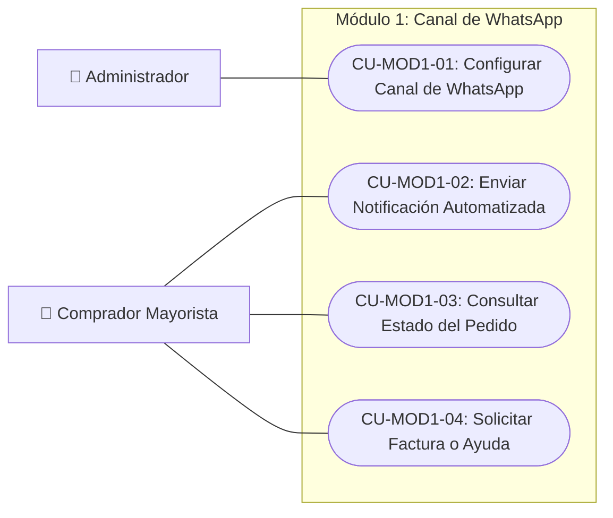

<!-- [SECTION_START: description] -->

Módulo 1: Canal de Comunicación automatizado y soporte vía WhatsApp Business Cloud.

```mermaid
flowchart LR
    %% Actores
    A["👤 Administrador"]
    C["👤 Comprador Mayorista"]

    %% Límite del Sistema (Módulo)
    subgraph M1 ["Módulo 1: Canal de WhatsApp"]
        direction TB
        UC1(["CU-MOD1-01: Configurar Canal de WhatsApp"])
        UC2(["CU-MOD1-02: Enviar Notificación Automatizada"])
        UC3(["CU-MOD1-03: Consultar Estado del Pedido"])
        UC4(["CU-MOD1-04: Solicitar Factura o Ayuda"])
    end

    %% Relaciones
    A --- UC1
    C --- UC2
    C --- UC3
    C --- UC4
```

<!-- [SECTION_END: description] -->
