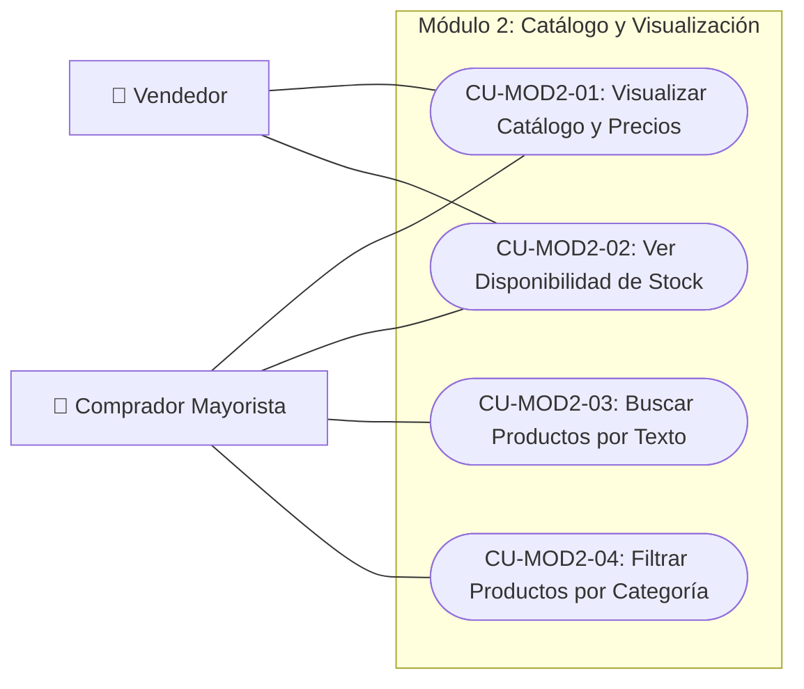

<!-- [SECTION_START: description] -->

Módulo 2: Visualización del catálogo de productos, búsqueda, filtros y presentación de precios B2B al cliente mayorista.

```mermaid
flowchart LR
    %% Actores
    C["👤 Comprador Mayorista"]
    V["👤 Vendedor"]

    %% Límite del Sistema (Módulo)
    subgraph M2 ["Módulo 2: Catálogo y Visualización"]
        direction TB
        UC1(["CU-MOD2-01: Visualizar Catálogo y Precios"])
        UC2(["CU-MOD2-02: Ver Disponibilidad de Stock"])
        UC3(["CU-MOD2-03: Buscar Productos por Texto"])
        UC4(["CU-MOD2-04: Filtrar Productos por Categoría"])
    end

    %% Relaciones
    C --- UC1
    V --- UC1
    C --- UC2
    V --- UC2
    C --- UC3
    C --- UC4
```

<!-- [SECTION_END: description] -->
