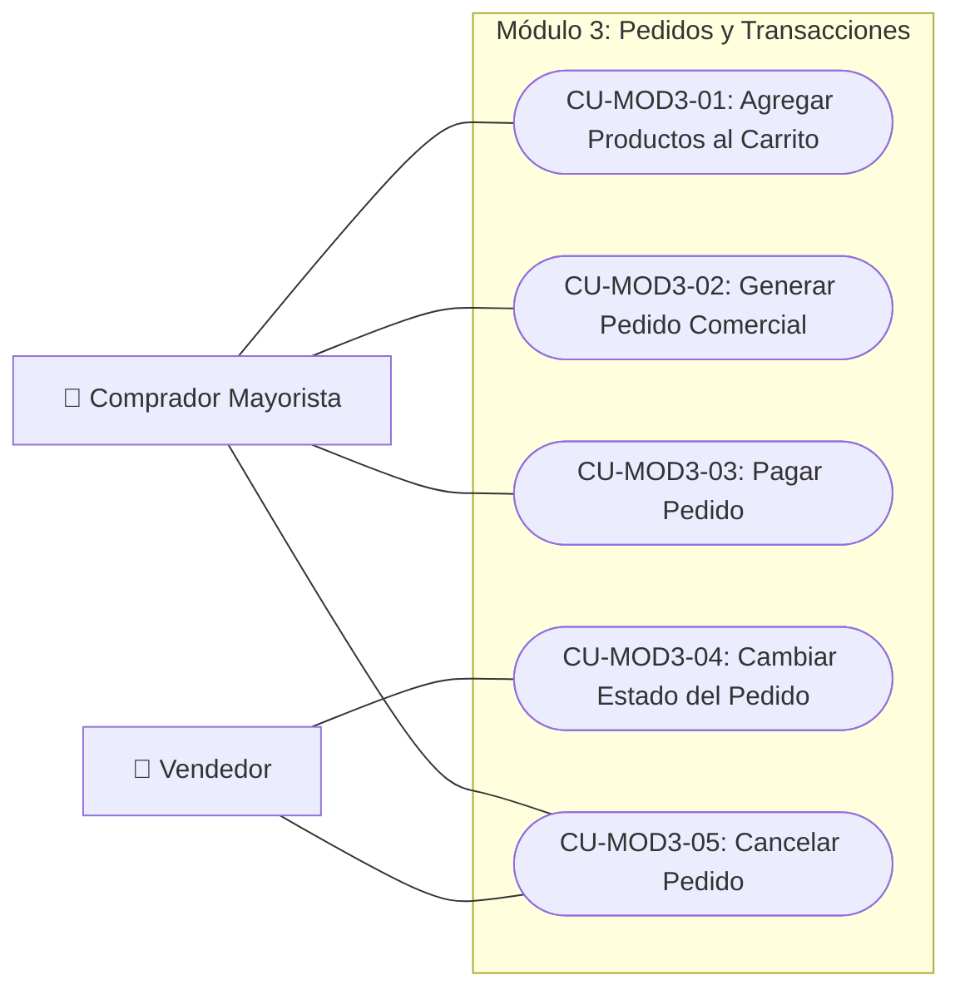

<!-- [SECTION_START: description] -->

Módulo 3: Gestión de compras, carrito, checkout transaccional y pagos mediante pasarela externa.

```mermaid
flowchart LR
    %% Actores
    C["👤 Comprador Mayorista"]
    V["👤 Vendedor"]

    %% Límite del Sistema (Módulo)
    subgraph M3 ["Módulo 3: Pedidos y Transacciones"]
        direction TB
        UC1(["CU-MOD3-01: Agregar Productos al Carrito"])
        UC2(["CU-MOD3-02: Generar Pedido Comercial"])
        UC3(["CU-MOD3-03: Pagar Pedido"])
        UC4(["CU-MOD3-04: Cambiar Estado del Pedido"])
        UC5(["CU-MOD3-05: Cancelar Pedido"])
    end

    %% Relaciones
    C --- UC1
    C --- UC2
    C --- UC3
    V --- UC4
    C --- UC5
    V --- UC5
```

<!-- [SECTION_END: description] -->
