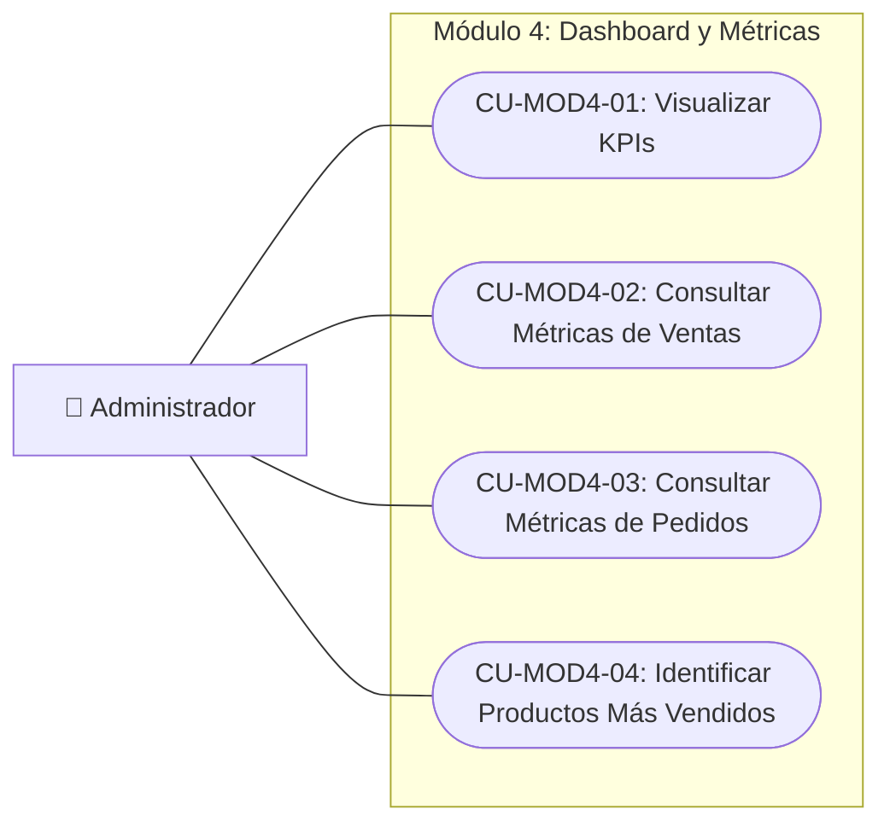

<!-- [SECTION_START: description] -->

Módulo 4: Análisis de datos, KPIs en tiempo real, reportes de ventas y métricas operativas del canal digital.

```mermaid
flowchart LR
    %% Actores
    A["👤 Administrador"]

    %% Límite del Sistema (Módulo)
    subgraph M4 ["Módulo 4: Dashboard y Métricas"]
        direction TB
        UC1(["CU-MOD4-01: Visualizar KPIs"])
        UC2(["CU-MOD4-02: Consultar Métricas de Ventas"])
        UC3(["CU-MOD4-03: Consultar Métricas de Pedidos"])
        UC4(["CU-MOD4-04: Identificar Productos Más Vendidos"])
    end

    %% Relaciones
    A --- UC1
    A --- UC2
    A --- UC3
    A --- UC4
```

<!-- [SECTION_END: description] -->
