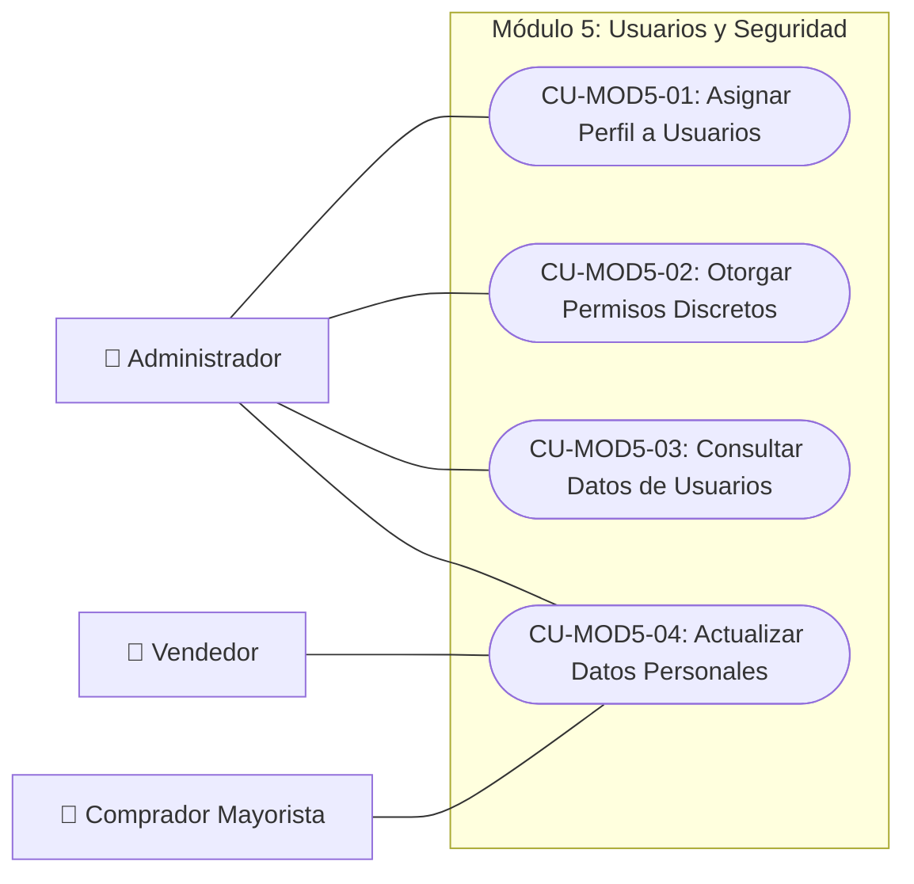

<!-- [SECTION_START: description] -->

Módulo 5: Gestión de Usuarios, Asignación de Roles, Control de Acceso y Edición de Perfiles.

```mermaid
flowchart LR
    %% Actores
    A["👤 Administrador"]
    V["👤 Vendedor"]
    C["👤 Comprador Mayorista"]

    %% Límite del Sistema (Módulo)
    subgraph M5 ["Módulo 5: Usuarios y Seguridad"]
        direction TB
        UC1(["CU-MOD5-01: Asignar Perfil a Usuarios"])
        UC2(["CU-MOD5-02: Otorgar Permisos Discretos"])
        UC3(["CU-MOD5-03: Consultar Datos de Usuarios"])
        UC4(["CU-MOD5-04: Actualizar Datos Personales"])
    end

    %% Relaciones
    A --- UC1
    A --- UC2
    A --- UC3
    A --- UC4
    V --- UC4
    C --- UC4
```

<!-- [SECTION_END: description] -->
