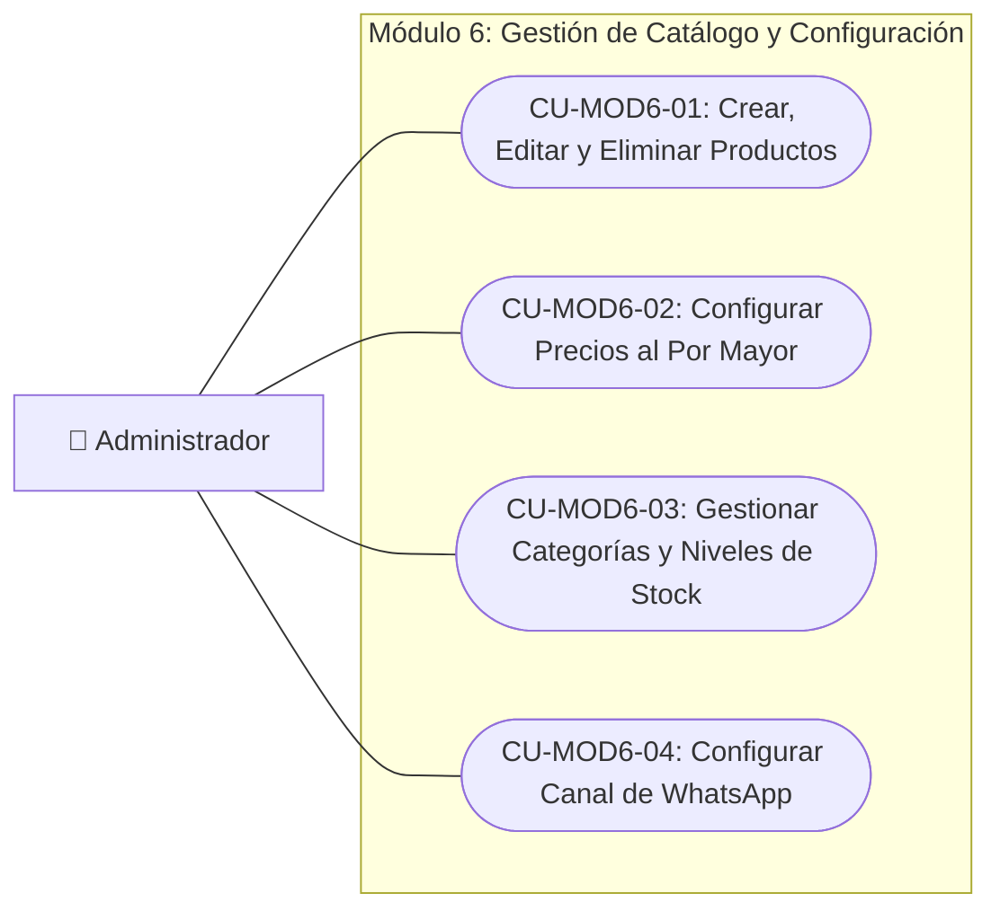

<!-- [SECTION_START: description] -->

Módulo 6: Administración de Inventario, Gestión Maestra del Catálogo, Configuración de Precios B2B y Mantenimiento de la Plataforma.

<!-- [SECTION_END: description] -->
