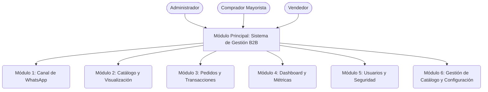

<!-- [SECTION_START: description] -->

Módulo de Alto Nivel que engloba toda la arquitectura del Canal de Ventas Mayorista B2B.

```mermaid
flowchart TD
    %% Nodo Principal
    P[Módulo Principal: Sistema de Gestión B2B]

    %% Módulos Secundarios
    M1(Módulo 1: Canal de WhatsApp)
    M2(Módulo 2: Catálogo y Visualización)
    M3(Módulo 3: Pedidos y Transacciones)
    M4(Módulo 4: Dashboard y Métricas)
    M5(Módulo 5: Usuarios y Seguridad)
    M6(Módulo 6: Gestión de Catálogo y Configuración)
    
    %% Relaciones
    P --> M1
    P --> M2
    P --> M3
    P --> M4
    P --> M5
    P --> M6

    %% Actores
    A([Administrador])
    C([Comprador Mayorista])
    V([Vendedor])

    A --> P
    C --> P
    V --> P
```

<!-- [SECTION_END: description] -->
